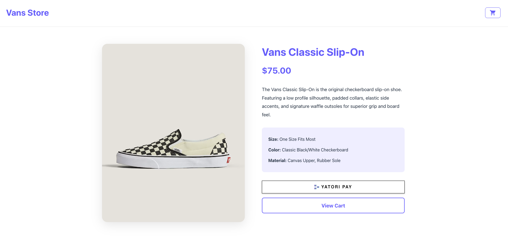
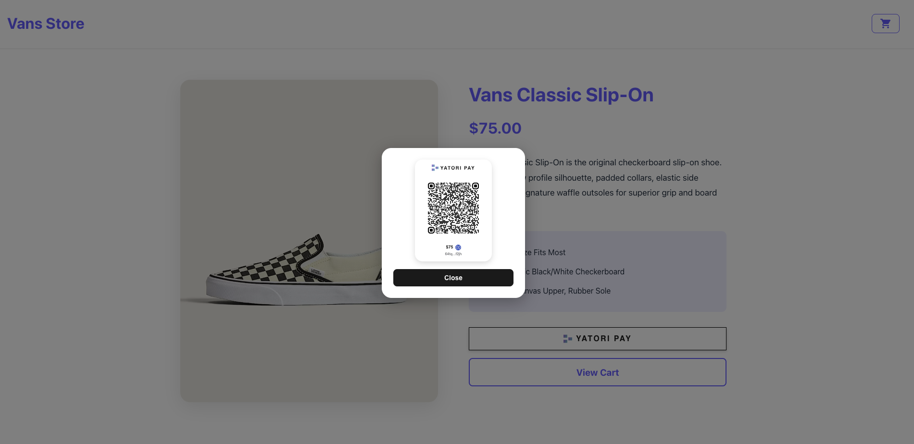

# Yatori Checkout

[](https://www.npmjs.com/package/yatori-checkout)
[](https://github.com/willmcdeezy/yatori-checkout/blob/main/LICENSE)
[](https://www.npmjs.com/package/yatori-checkout)


A web component for seamless USDC stablecoin payments on Solana with QR code checkout and WebSocket confirmation. Learn more at [Yatori Checkout](https://yatori.io/yatori-checkout)

## Screenshots

### React Template Example





*These screenshots show the React template example. Code can be found here: [yatori-checkout-react-template](https://github.com/willmcdeezy/yatori-checkout-react-template)*

## Installation
```bash
npm install yatori-checkout
```

## Quick Start
```javascript
import 'yatori-checkout'
```
```html
<!-- Default: Uses dialog on desktop (button opens modal) -->
<yatori-checkout
  wallet="G8RtxPyG2pdrAhrNRMgg7Hia8imCofdCYxvyWiNG14hx"
  amount="9.99"
></yatori-checkout>

<!-- Disable dialog: Shows QR code directly on desktop -->
<yatori-checkout
  wallet="G8RtxPyG2pdrAhrNRMgg7Hia8imCofdCYxvyWiNG14hx"
  amount="9.99"
  useDialog="false"
></yatori-checkout>
```

> **Important:** The recipient wallet address must have at least 0.01 USDC already deposited for rent (USDC PDA on Solana).

## Dialog Behavior

By default, the component uses a dialog mode on desktop devices:

- **Desktop with `useDialog=true` (default)**: Shows a "YATORI PAY" button. Clicking it opens a centered modal dialog with the QR code and a close button.
- **Desktop with `useDialog=false`**: Displays the QR code directly without a dialog.
- **Mobile devices**: Always shows the "YATORI PAY" button with deeplink functionality (dialog setting is ignored).

To disable the dialog and show the QR code directly on desktop, set `useDialog="false"`:

```html
<yatori-checkout
  wallet="G8RtxPyG2pdrAhrNRMgg7Hia8imCofdCYxvyWiNG14hx"
  amount="9.99"
  useDialog="false"
></yatori-checkout>
```

## Vanilla HTML Example
```html
<!DOCTYPE html>
<html lang="en">
<head>
  <meta charset="UTF-8">
  <meta name="viewport" content="width=device-width, initial-scale=1.0">
  <title>Yatori Checkout Example</title>
</head>
<body>
  <h1>Payment Checkout</h1>
  
  <yatori-checkout
    wallet="G8RtxPyG2pdrAhrNRMgg7Hia8imCofdCYxvyWiNG14hx"
    amount="9.99"
  ></yatori-checkout>

  <script type="module">
    import 'yatori-checkout'
    
    const checkout = document.querySelector('yatori-checkout')
    checkout.addEventListener('yatori-confirmed', (event) => {
      console.log('Payment confirmed!', event.detail)
      alert('Payment successful!')
    })
  </script>
</body>
</html>
```

## Vue.js Example

First, configure Vue to recognize `yatori-checkout` as a custom element in your `vite.config.js`:
```javascript
import { defineConfig } from 'vite'
import vue from '@vitejs/plugin-vue'

export default defineConfig({
  plugins: [
    vue({
      template: {
        compilerOptions: {
          isCustomElement: (tag) => tag.startsWith('yatori-')
        }
      }
    })
  ]
})
```

Then use it in your component:
```vue
<template>
  <yatori-checkout
    wallet="G8RtxPyG2pdrAhrNRMgg7Hia8imCofdCYxvyWiNG14hx"
    amount="9.99"
    @yatori-confirmed="handlePayment"
  ></yatori-checkout>
</template>

<script setup>
import 'yatori-checkout'

function handlePayment(event) {
  console.log('Payment confirmed!', event.detail)
  // event.detail contains: { signature, status }
}
</script>
```

## React Example
```tsx
import "./App.css";
import { YatoriCheckout } from "yatori-checkout/react";

function App() {
  return (
    <>
      <div>
        <YatoriCheckout
          wallet="G8RtxPyG2pdrAhrNRMgg7Hia8imCofdCYxvyWiNG14hx"
            amount={0.01}
        />
      </div>
    </>
  );
}

export default App;
```

## Next.js Example

When using in a Next.js application, use dynamic import to ensure client-side rendering:
```tsx
"use client";

import dynamic from "next/dynamic";

const YatoriCheckout = dynamic(
  () => import("yatori-checkout/react").then((mod) => mod.YatoriCheckout),
  {
    ssr: false,
    loading: () => (
      <div className="w-full flex justify-center items-center h-[300px]">
        <div className="animate-pulse">
          <div className="h-10 bg-gray-300 rounded w-48"></div>
        </div>
      </div>
    ),
  }
);

export default function MyYatoriCheckout() {
  return (
    <YatoriCheckout
      wallet="G8RtxPyG2pdrAhrNRMgg7Hia8imCofdCYxvyWiNG14hx"
      amount={10}
      onYatoriConfirmed={(event) => {
        console.log("Payment confirmed", event.detail);
      }}
      onYatoriAnimationComplete={(event) => {
        console.log("Animation complete", event.detail);
      }}
    />
  );
}
```

## Props/Attributes

| Attribute | Type | Required | Default | Description |
|-----------|------|----------|---------|-------------|
| `wallet` | string | Yes | - | Recipient wallet address (Solana). Must have at least 0.01 USDC already deposited for rent (USDC PDA). |
| `amount` | number | Yes | - | Payment amount in USD decimal format (e.g., 9.99, must be between 0.01 and 9999.99) |
| `useDialog` | boolean | No | `true` | When `true` and not on mobile, displays a "YATORI PAY" button that opens a centered dialog with the QR code. When `false`, displays the QR code directly. On mobile devices, always shows the deeplink button regardless of this setting. |

## Events

### `yatori-confirmed`

Fired when payment is confirmed via WebSocket.
```javascript
element.addEventListener('yatori-confirmed', (event) => {
  const { signature, status } = event.detail
  // Handle payment confirmation
})
```

### `yatori-animation-complete`

Fired 5 seconds after payment confirmation, when the payment complete animation finishes. This is useful for hiding the component or updating UI after the animation completes.
```javascript
element.addEventListener('yatori-animation-complete', (event) => {
  const { signature, status } = event.detail
  // Animation is complete, component can be hidden or UI updated
})
```

## Shadow DOM CSS Custom Properties

The component uses Shadow DOM, but you can customize the button styling using CSS custom properties (CSS variables) with the `--yp-` prefix. These variables can be set on the `yatori-checkout` element or any parent element.

### Available Custom Properties

| Variable | Default | Description |
|----------|---------|-------------|
| `--yp-button-border-width` | `1px` | Border width of the button |
| `--yp-button-border-color` | `black` | Border color of the button |
| `--yp-button-border-radius` | `0px` | Border radius of the button |
| `--yp-button-height` | `48px` | Height of the button (minimum: 44px) |
| `--yp-button-width` | `100%` | Width of the button (minimum: 200px) |

> **Note:** The button has minimum size constraints to ensure usability. The minimum width is 200px and minimum height is 44px. Values below these minimums will be automatically clamped.

### Example Usage

```html
<style>
  yatori-checkout {
    --yp-button-border-radius: 2px;
    --yp-button-border-color: #007bff;
    --yp-button-border-width: 2px;
    --yp-button-height: 52px;
    --yp-button-width: 200px;
  }
</style>

<yatori-checkout
  wallet="G8RtxPyG2pdrAhrNRMgg7Hia8imCofdCYxvyWiNG14hx"
  amount="9.99"
></yatori-checkout>
```

```css
/* In your CSS file */
yatori-checkout {
  --yp-button-border-radius: 12px;
  --yp-button-border-color: #333;
  --yp-button-border-width: 2px;
  --yp-button-height: 52px;
  --yp-button-width: 300px;
}
```

## Features

- ✅ QR code generation with Yatori branding
- ✅ Dialog mode (default): Desktop users click a button to open a centered modal with QR code
- ✅ Direct QR display: Option to show QR code directly without dialog (`useDialog="false"`)
- ✅ WebSocket payment confirmation
- ✅ Mobile responsive: On mobile devices, displays "Yatori Pay" button with secure deeplink functionality to [YATORI PAY](https://yatori.io/yatori-pay)
- ✅ Amount validation (max 9999.99)
- ✅ Beautiful payment complete animation
- ✅ Works in any framework (Vue, React, vanilla JS, etc.)

## Payment Method

Payable with the **YATORI PAY** mobile app. Available for download on the [Apple App Store](https://apps.apple.com/us/app/yatori-pay/id6736435772) or [Google Play Store](https://play.google.com/store/apps/details?id=io.yatori.app). More info: [https://yatori.io/yatori-pay](https://yatori.io/yatori-pay)

## License

MIT

## Links

- [Yatori](https://yatori.io)

- [Checkout YouTube Demo](https://www.youtube.com/watch?v=55-TJJdhLAo)